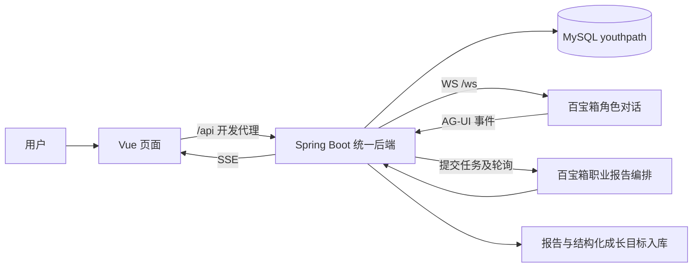

# 仓库现状与环境核对（2026-09-24）

> 更新：后续三场景完整实现已完成，请以 [职场训练完整使用说明](职场训练-完整实现与使用说明.md) 为当前状态。本文保留该阶段记录。
> 本文保留重新理解仓库时的基线与环境记录。后续已在 `feat/interview-training` 完成首个模拟面试闭环，并验证真实登录和平台调用；当前状态、操作步骤与接口请以 [职场训练实施与验收](职场训练-首个小目标实施与验收.md) 为准。

本次以小组最新代码重新设计职场场景模拟训练。本文记录已经读到的代码事实；新增功能方案见 [职场场景模拟训练设计](职场场景模拟训练设计.md)。设计中的接口、页面与数据表均不代表已经实现。

## 1. 本次工作基线

| 项目 | 核对结果 |
| --- | --- |
| 正式 Git 仓库 | `August13-B/star-career-agent-zhejiang2026` |
| 已成功获取的开发分支提交 | `2703ae07e588ec49734ce2ba533ab1b2466493f4`，PR #89 合并后的版本 |
| 本次工作分支 | `feat/scenario-training-design`，从上述 `origin/develop` 新建 |
| 更新量 | 相比原本地基线，取得 29 个新提交 |
| 本次交付 | 仓库重新理解、环境配置核对、三类训练的设计文档 |
| 实现状态 | 未新增训练业务代码、数据库迁移或平台应用；后续完成本机 RSA 公钥配置适配；未提交、推送、创建 PR |

已撤销能明确归属于上一轮助手工作的本地源码改动，删除旧导读、开发计划、功能说明、复测文档、报告编排包及自建测试源码。小组已提交的代码和文档以最新 Git 版本为准，不能把“删除旧内容”理解为删除小组历史成果。Python、JDK、MySQL 数据目录和现有密钥保留。

本次工作中重新检查远端时曾遇到 GitHub 连接超时，随后重试 fetch 成功，`HEAD` 与 `origin/develop` 仍一致为上述提交。交付前最后一次检查又遇到连接重置，因此上述提交是本次最后成功确认的版本，不对之后的远端状态作保证。后续实现与上传前仍须再次 fetch 并查看差异。

清理限制：自动审批拒绝执行旧测试产物的递归删除，以及明确列出的 PDF/图片删除，只返回 `blocked by policy`。已通过逐文件方式清理旧方案和测试源码、JSON 结果；部分旧 PDF、图片和编译缓存仍留在本地，本次未声称这些二进制产物已经删除。

## 2. 当前项目怎样运行



### 目录与责任

| 位置 | 实际用途 | 训练模块接入关系 |
| --- | --- | --- |
| `前端/src/views/` | Vue 页面，各页面包含较多自己的交互逻辑 | 新增训练大厅、工作台、结果页 |
| `前端/src/router/index.js`、`前端/src/App.vue` | 页面路由、应用外壳和导航 | 增加训练入口，遵循现有样式 |
| `前端/src/utils/sse.js` | 增量读取 SSE，处理分片、换行和 UTF-8 解码 | 可以复用；它只返回 `data`，不会保留 SSE 的 `id/event` |
| `后端/src/main/java/org/example/web/` | 用户、画像、能力、对话、报告、成长等业务 | 训练业务放在此包的对应分层中 |
| `后端/src/main/java/wwy/example/springboot/` | 岗位库及岗位相关能力，与前一包运行在同一后端中 | 复用岗位信息；不再另建后端进程 |
| `后端/src/main/resources/` | Spring 配置、Mapper XML、题库等资源 | 放模板资源和新 Mapper XML |
| `数据库/数据库结构.sql`、`数据库/migrations/` | 全量结构与增量迁移，当前迁移编号至 009 | 实现阶段同步修改结构、增量迁移和自动迁移列表 |
| `百宝箱/` | 平台接入说明、提示词与编排约定 | 新训练协议在此与平台负责人对齐 |
| `manage.py`、`manage_gui.py` | Python 服务管理、配置加载、数据库初始化/迁移、日志 | 加载 `后端/.env`；不是训练服务 |
| `.github/workflows/ci.yml` | 后端测试、前端测试与构建，最后汇总 `CI 通过` | 新功能继续走此检查 |

主要技术栈：Vue 3、Vite、ECharts；Java 17、Spring Boot 3.5、MyBatis、JWT；MySQL；百宝箱 WS/任务接口。前端 Node 版本要求来自 `package.json`：`^20.19.0 || >=22.12.0`。

### 当前页面对应什么

| 路由 | 页面 | 主要职责 |
| --- | --- | --- |
| `/` | `AgentView.vue` | 普通智能体对话，流式接收、对话历史 |
| `/graph` | `GraphView.vue` | 职业星图与岗位探索 |
| `/compare` | `JobCompareView.vue` | AI 岗位定位和岗位分析 |
| `/job-detail` | `JobDetailView.vue` | 岗位详情 |
| `/ai-score` | `AiScoreView.vue` | 独立 AI 能力分析展示；不能直接等同于数据库中的个人评分历史 |
| `/multi-agent` | `MultiAgentView.vue` | 职业报告多智能体过程和结果 |
| `/growth` | `GrowthView.vue` | 长期规划、成长任务及完成记录 |
| `/profile` | `UserCenterView.vue` | 个人资料、能力数据、职业报告等个人记录 |
| `/tutor-dashboard` | `TutorDashboardView.vue` | 导师相关视图 |
| `/admin/job-info` | `JobInfoAdmin.vue` | 岗位资料管理 |
| `/login` | `LoginView.vue` | 登录与账户入口 |

当前路由中没有训练大厅或训练工作台。已有 `scenario_score` 文本展示能力不等于三类训练已经完成。

## 3. 这次更新中最重要的业务链路

### 普通对话

- 浏览器调用 `/api/ai-conversation/...`；后端 `AIConversationServiceImpl` 组织历史和用户上下文。
- `StudentProfileContextService` 构建画像、十维评分等上下文；普通对话还使用最新职业报告摘要。
- 当前默认 `TBOX_CHAT_CHANNEL=ws`，`TboxAgentServiceImpl` 对接平台 `/ws` 并向浏览器桥接 SSE。
- PR #88 已改为增量透传；前端有独立 SSE 解析工具及测试。
- 新训练应使用受控、最小化的训练上下文和独立会话标识，避免把扮演经历作为真实简历信息带入普通对话。

### 职业报告与成长规划

- 报告走平台异步任务：提交、轮询增量、结束后存库，并支持取消。
- 六段报告中第六段形成最终简介；结构化 `goals` 经处理写入报告内容及 `grow_plan/grow_task`。
- 前端详情与 PDF 使用最终简介；目标块与中间过程的展示规则已有小组实现。
- 成长任务已有新增、修改状态、删除以及完成记录等接口；`grow_task_record` 是迁移 008 新增的能力。
- 训练建议应接入这些成长记录，不需要重新设计一套职业报告编排。

### 能力数据

- `AbilityQuizServiceImpl.submit()` 可形成十维初始评分：四个硬维度、六个软维度。
- 当前实现先逻辑删除旧系统评分，再插入新系统评分；评分评语经现有服务加密。
- 数据库已有 `student_ability_score_history` 和 `student_profile_history`，但当前评分服务没有完整写入这两张历史表的闭环；不能直接宣称调用现有 insert/update 就会版本加一。
- 能力评分要求非空 `ability_id`；历史还要求 `score_id`，版本注释要求与画像版本一致。训练回写必须处理这些真实约束。
- `UserCenterView` 从 `/api/ability/score/user/{userId}` 读取能力记录。训练完成后的刷新和系统/导师/企业评分选择需要联调，不能只画一个临时雷达图。

## 4. 已有能力与新增缺口

| 领域 | 代码证据 | 设计结论 |
| --- | --- | --- |
| 三类训练方向 | 差异分析文档、`百宝箱/提示词-智能体创建.md` | 方向已有；补具体任务、轮次、产物与验收 |
| 评分字段 | `scenario_score`，三种场景代码、维度、总分、评语、建议 | 保留旧字段含义，新增版本及证据协议 |
| 平台评分卡 | `TboxAgentServiceImpl.handleEvent()` 把 CUSTOM 卡转 Markdown | 新适配器必须保留原始结构，不能反向解析展示文本入库 |
| 训练存储 | `interview_record` 只有问答、分数、建议等基础列 | 不足以支撑跨场景会话、执行状态、作品版本和重连 |
| 对话组件 | 现有逻辑主要在页面 SFC 中 | 复用工具和样式；共享训练组件需新增/抽取，不假设已有通用组件 |
| 切页恢复 | 报告已有平台任务标识及恢复思路 | 训练也需服务端会话与执行状态；只加 keep-alive 不足够 |
| 能力历史 | 有表及实体，缺完整写入流程 | 新增事务服务及真实 Mapper 实现 |
| 人岗匹配 | `MatchServiceImpl.calculateMatch()` 中 AI 调用仍为 TODO | 训练第一版不自动调用此接口并宣称匹配成功；后续与真实链路单独联调 |

判断依据以当前代码为准。README 和 `.pi/PROJECT.md` 中历史“平台阻塞”等描述，需要运行验证后才能作为当前状态结论。

## 5. 本地配置核对结果

使用仓库 `manage.load_env()` 读取配置，不输出密钥值；检查结果如下。

| 项目 | 结果与处理 |
| --- | --- |
| `后端/.env` | 已存在且被 Git 忽略 |
| 默认项 | 补齐 `MAIL_HOST`、`MAIL_PORT`、`TBOX_CHAT_CHANNEL`、`TBOX_CHAT_TIMEOUT_SECONDS`、`TBOX_REPORT_POLL_SECONDS`、`TBOX_REPORT_PARTIAL_TIMEOUT_SECONDS`、`TBOX_REPORT_TOKEN` |
| 原有配置 | 全部保留，并在写入后逐项比较确认没有改变 |
| AES | 密钥 32 字节、IV 16 字节，符合代码使用的 AES 要求；未轮换 |
| 后端 RSA | 本地公私钥成对 |
| 前后端 RSA | 已修复：`utils/crypto.js` 优先读取本地 `VITE_RSA_PUBLIC_KEY`，与后端现有私钥配对；无本地配置时沿用团队默认公钥 |
| 报告令牌 | `TBOX_REPORT_TOKEN` 当前为空；若平台启用报告认证，必须补对应真实值 |
| 平台 API 密钥 | 用户已填写 `TBOX_API_KEY`；尚未进行平台运行鉴权验证 |
| 邮箱 | 用户已填写 `MAIL_USERNAME`、`MAIL_PASSWORD`；尚未发送测试邮件 |
| 百宝箱地址 | 已配置；本次未进行付费模型调用或运行连通性验收 |
| 数据库 | 本地配置端口 3307；本次未重建数据库或导入用户数据 |
| 服务状态 | 检查时 Python 管理器显示服务未启动；不等同于完整环境验收通过 |

`manage.py` 当前提供启动、停止、状态、日志、数据库管理等命令；`manage_gui.py` 是对应图形管理入口。未找到专门生成整套密钥配置的脚本命令。二者可以加载 `.env`，但无法凭空补出团队使用的私钥与平台令牌。

后续 RSA 核对发现：后端原公私钥本来成对，前端团队默认公钥属于另一对密钥。因此保留现有私钥，在 `fix/local-rsa-public-key-config` 分支为前端增加公钥环境变量支持；`前端/.env.local` 的 `VITE_RSA_PUBLIC_KEY` 已由现有私钥导出并与后端公钥同步。该文件仅含公钥且被 Git 忽略，后端其他配置值均保留。没有替换数据库 AES 或 RSA 私钥。

验证使用项目实际 `crypto.js` 中的函数与已安装的 JSEncrypt/CryptoJS，通过 Vite `loadEnv` 分别读取开发和生产配置。前端加密的 AES key/IV 均可用现有后端私钥解开，AES 密文可正确还原中文测试数据；未配置/空白环境变量时仍使用原团队公钥。验证未启动后端，因此不等同于完整登录接口验收。

本次没有运行 `db --force`，也没有启动/构建应用。已实际运行 `python manage.py --help`、`python manage.py status` 并验证系统 Python 3.13.14 能导入 Tkinter；这些检查通过不代表数据库及平台联调通过。

### 手动填写的位置

正式配置：`D:\my\star-career-agent-zhejiang2026\后端\.env`。参考模板：同目录 `.env.example`。不要把真实密钥填写进模板并提交 Git。

首次整理时已把以下待填项移到 `.env` 顶部并添加中文注释，没有重复定义。下方仅为字段示意：用户目前已填前三项，报告令牌仍为空。

```dotenv
MAIL_USERNAME=
MAIL_PASSWORD=
TBOX_API_KEY=
TBOX_REPORT_TOKEN=
```

| 填写项 | 从哪里取得 | 何时需要 |
| --- | --- | --- |
| `MAIL_USERNAME` | 使用的发信邮箱地址 | 注册/找回密码等邮件验证码功能 |
| `MAIL_PASSWORD` | 该邮箱开启 SMTP 后生成的授权码 | 和上项配套；不是邮箱登录密码 |
| `TBOX_API_KEY` | 小组当前应用的百宝箱鉴权配置/平台凭证 | 取决于应用鉴权，不能随机填写占位值 |
| `TBOX_REPORT_TOKEN` | 平台 `REPORT_API_TOKEN` 对应值 | 平台启用报告接口令牌时必填；未启用可空 |

`RSA_PRIVATE_KEY`、`RSA_PUBLIC_KEY` 与本机前端使用的公钥已匹配，无需手动重新生成。`TBOX_API_URL`、`TBOX_AGENT_ID` 应对应小组当前发布应用；数据库和 AES 配置已保留。前端公钥配置改变后需重启前端；已构建的静态页面需在对应配置下重新构建才能使用新值。

脚本按 `KEY=VALUE` 逐行加载，不会自动剥掉引号，也不解析多行 PEM。填写时每个值保持一行，不加引号、不加行尾注释；RSA 使用项目约定的单行 Base64 DER 内容。

### Python 管理器怎么用

在 PowerShell 中切换到正式仓库，再选择需要的命令：

```powershell
Set-Location 'D:\my\star-career-agent-zhejiang2026'
python manage.py gui
```

以上打开图形管理器；也可直接运行 `python manage_gui.py`。它提供前端、后端、可选 Nginx 的启动、停止、重启和日志，没有 `.env` 配置编辑表单。

命令行替代方式：

```powershell
python manage.py status
python manage.py db status
python manage.py start all
python manage.py restart backend
python manage.py stop all
```

这些命令按需单独执行，不是要求依次全部执行。修改 `.env` 后重启后端；修改 `SERVER_PORT` 后也应重新打开管理器以重新读取端口。

启动脚本会在后端启动前检查并初始化/迁移数据库，前端缺依赖时会尝试安装依赖；它不负责启动 MySQL 服务本身。应先确保配置指向的 MySQL 已运行。需要诊断时用 `db status`；常规迁移使用已有幂等迁移，不能用 `db --force` 代替迁移。

本机先前准备的 Java 17 保留在 `D:\my\.star-career-local\jdk\jdk-17.0.20.1+1`。脚本自动探测不保证覆盖此目录，必要时在启动管理器前设置当前 PowerShell 会话的 `JAVA_HOME`：

```powershell
$env:JAVA_HOME = 'D:\my\.star-career-local\jdk\jdk-17.0.20.1+1'
python manage.py gui
```

不修改系统全局 Java 配置。此处仅给出已有脚本的使用方法，没有替换小组启动工具。

## 6. 分工和 Git 约束

以工作区 `说明.txt` 为依据：你负责“职业场景模拟前后端设计 2”；另一名成员负责“设计 1”；还有成员负责百宝箱场景模拟编排。本次提供三类场景共同遵循的完整方案，具体编码拆分作为建议，不覆盖小组已经安排的职责。

每轮修改、测试及上传前，先检查工作区和远端变更。所有修改在新功能分支；上传前 fetch 并合入最新 develop、检查冲突；只向功能分支推送；PR 目标只能是 develop；CI 全部通过才能合并；不删除他人远端分支。仓库内部文档中“无 CI 则跳过”的旧约定不覆盖 `说明.txt` 的强制要求。

现有 CI 包含后端测试、前端 `npm test` 和构建，汇总检查名为 `CI 通过`。本次未查询 GitHub 分支保护配置，因此不声称已验证必需检查设置。
