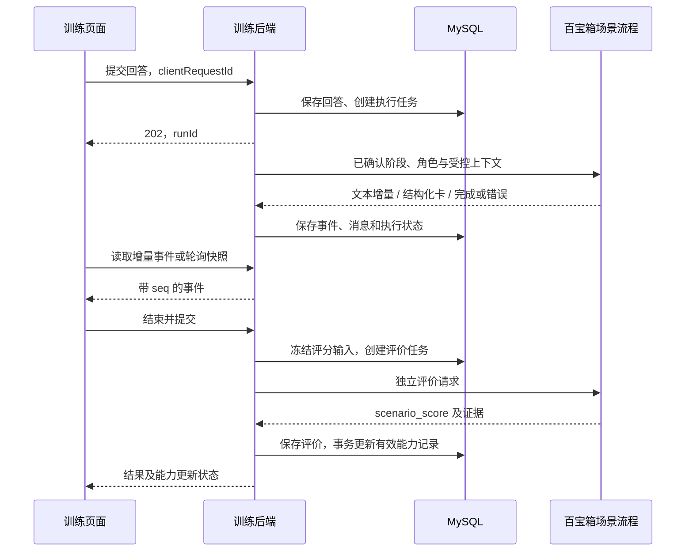

# 职场场景模拟训练设计

> 设计日期：2026-09-24。代码基线：`origin/develop@2703ae0`。
> 状态：三场景及画像、成长联动已在本地实现。当前功能、实际接口和验收以 [完整实现与使用说明](职场训练-完整实现与使用说明.md) 为准；下文保留最初总体设计，包含未纳入第一版的扩展设想。
> 现有架构、配置与已发现的接入缺口见 [仓库现状与环境核对](仓库现状与环境核对-20260924.md)。

## 1. 要交付的产品

在现有星职应用中新增“职场训练”入口，让用户完成一次有明确任务、有真实交互、有成果、有证据反馈的训练。采用统一训练框架，提供三种不同玩法：模拟面试、跨岗位沟通、AI 辅助办公。

完整路径：选择场景 → 阅读任务 → 多轮练习/修改作品 → 提交 → 查看有证据的评分 → 更新能力记录 → 把改进建议加入成长任务 → 再次训练。

A02 原文同时出现“至少三种典型场景”和“至少一个互动式场景”。最终交付按较完整的三场景要求落实；首个小目标先跑通一个真实互动场景，不能把三个不同开场白当成三个已经交付的模块。

第一版支持文本对话、固定训练材料、作品编辑、评分、恢复会话与历史。语音、视频面试、任意文件解析、真实邮件发送和外部办公软件操作不作为第一版完成条件。

## 2. 用户入口和共用功能

| 功能 | 用户怎么用 | 完成标准 |
| --- | --- | --- |
| 训练大厅 | 选择三类场景，查看目标、预计用时和训练记录 | 三类场景均有独立任务与模板 |
| 训练准备 | 选择岗位/难度，阅读材料和评分维度 | 开始前说明这是模拟材料；不要求重新填写完整简历 |
| 工作台 | 根据场景进行对话、协商或编辑作品 | 可以滚动、暂离、刷新后继续 |
| 完成训练 | 主动提交；系统冻结本次回答和作品 | 不把普通聊天中的“结束”文字直接当作完成指令 |
| 反馈页 | 看本次得分、对应回答/作品证据、改进建议 | 可从评价定位到原始内容；无证据不编造高分 |
| 能力记录 | 查看哪些维度采用了训练结果，以及更新前后值 | 无关维度保持原值；有历史与来源 |
| 成长衔接 | 选择一条建议加入已有计划，后续记录练习结果 | 用户能看到任务名、目标能力和完成标准 |
| 历史与复训 | 查看自己的训练记录，使用同模板再次练习 | 旧记录不被覆盖；仅同模板/评分版本适合直接比较 |

允许尚未完成基础测评的用户体验训练；没有有效画像、能力及基线评分时，只保存训练反馈，显示“先完成基础测评，再用于能力更新”。不得为凑齐数据自动把缺失维度填成 0 或 60。

准备页默认开启“完成后用于更新相关能力记录”，用户可以关闭；选择会随会话保存。评分是练习反馈，不用于自动录用、淘汰或证明实际任职资格。

## 3. 三个场景具体怎么玩

### 3.1 模拟面试 `mock_interview`

**目标：** 用户练习结合具体经历回答岗位问题，并在追问中说明自己的判断。首个模板采用“Java 后端实习生”，后续复用岗位库扩展岗位。

**参与者：** 用户为候选人，AI 为面试官。面试官可以追问，但每次只提出一个主要问题；评分者在结束后单独运行。

**默认过程：** 6 个主问题，最多 2 个针对性追问，约 10–15 分钟。时间是提示，不因打字慢扣分。

| 阶段 | 题目目标/例子 | 用户应留下的证据 |
| --- | --- | --- |
| 1 | 简述适合目标岗位的一项经历 | 本人职责与具体产出 |
| 2 | 深挖一次接口或数据库设计 | 选择理由、约束、替代方案 |
| 3 | 排查“重复提交导致重复数据” | 定位步骤、幂等/并发意识、验证方法 |
| 4 | 面对需求变更与队友分歧 | 如何沟通取舍，而不是只评价他人 |
| 5 | 截止日期前发现缺陷 | 风险判断、分级处理和及时求助 |
| 6 | 总结不足并提出下次验证计划 | 可以执行的改进行动 |

追问由前一回答的缺失信息触发；服务器控制题目顺序和剩余追问次数，模型不能自行无限延长。用户可以跳过某题，记录为“缺少证据”；主动提前结束可获得阶段性文字反馈，未满足维度覆盖时不写入能力画像。

**产物：** 面试问答记录、四维评分、引用回答的优缺点、1–3 条可执行练习建议。参考回答只在提交后展示，并说明需要结合真实经历，不能用来编造简历。

### 3.2 跨岗位沟通 `cross_role_communication`

**目标：** 用户在信息不完整、目标冲突的远程协作中完成需求澄清、风险协调和任务交接。

**固定案例：** 周五计划发布报名系统；业务希望增加导出功能，开发仅剩 2 人日，测试尚有 1 个阻断缺陷。用户扮演项目协调人；AI 分别扮演产品、开发、测试。事实卡中提前固定时间、资源和各角色诉求。

| 阶段 | AI 角色和冲突 | 用户动作 |
| --- | --- | --- |
| 澄清 | 产品提出“这周一定要全部上线” | 问清必须交付的范围和验收条件 |
| 约束 | 开发解释人日限制与技术依赖 | 核对资源，拆分必须/可以延期的内容 |
| 风险 | 测试提出阻断缺陷，拒绝直接放行 | 讨论修复、回归、灰度/延期或回退条件 |
| 协商 | 角色之间交换可接受方案 | 明确取舍、升级路径、待确认事项 |
| 交接 | 角色追问“谁来做、何时完成” | 提交协作确认单 |

默认 5 个阶段、最多 8 次用户消息。按阶段由编排器调度角色，界面明确标注说话者；不是三个角色同时输出长文。角色只能使用固定事实及已确认信息，不能随意改变资源来让用户“通关”。

**产物：** 协作确认单，包含交付范围、负责人、截止时间、验收条件、风险及回退/升级路径、待确认事项。尚未达成一致时允许写“待确认”，不把 AI 的礼貌赞同当作实际承诺。

重点评价澄清、倾听、冲突处理和责任闭环；避免以“服从强势角色”作为高分标准。

### 3.3 AI 辅助办公 `ai_assisted_office`

**目标：** 用户会给 AI 明确任务，会检查 AI 的错误，并对最终交付负责。不能只把 AI 生成的答案粘贴出来就算完成。

**固定案例：** 根据虚构活动数据和会议纪要，制作一份活动复盘摘要及待办清单。第一版直接在页面提供材料，不依赖 Excel/Word 上传解析。

训练数据明确标注为虚构：

| 渠道 | 访问人数 | 意向人数 | 报名人数 |
| --- | ---: | ---: | ---: |
| 校园公众号 | 1000 | 120 | 24 |
| 社群 | 500 | 80 | 20 |
| 短视频 | 2000 | 100 | 10 |
| 合计 | 3500 | 300 | 54 |

补充事实：会议决定由小林在周三 18:00 前汇总复盘，小陈核对数据；是否增加投放尚未决定。报名/意向转化率分别为 20%、25%、10%，总体为 18%。这些计算与事实由模板固定，不交给模型随意生成。

| 步骤 | 用户操作 | 训练目的 |
| --- | --- | --- |
| 1. 布置任务 | 输入自己的提示词，明确材料、读者、结构和约束 | 任务拆解与上下文组织 |
| 2. 生成初稿 | AI 根据用户要求生成草稿 | 观察并使用 AI 辅助过程 |
| 3. 核验练习 | 检查一份固定的“待核验练习稿” | 确保每次都能练习辨错，不依赖模型偶然犯错 |
| 4. 修订 | 对照材料标记错误、说明依据、编辑最终稿 | 验证事实、区分建议与决策 |
| 5. 提交 | 提交摘要、待办表和核验清单 | 对最终产物负责 |

待核验练习稿故意包含三个错误：“总报名 64 人”“总体转化率 21.3%”“短视频转化率最高”；另包含一个无依据结论“会议已批准增加投放”。页面说明练习稿可能有错，不把预置错误伪装成实时模型结果。

**产物：** 初始提示词、AI 草稿、用户核验记录、最终复盘文稿和负责人/时间/验收明确的待办表。AI 草稿和用户最终稿分别存版本，评分只使用已经提交的版本。

明确不评价用户是否购买某个办公工具，也不执行文档中的脚本、外部链接指令或真实发送动作。

## 4. 页面与状态设计

### 路由与组件（拟新增）

| 路由 | 文件 | 内容 |
| --- | --- | --- |
| `/training` | `TrainingLobbyView.vue` | 三类场景卡片、准备表单、最近训练、完整历史筛选 |
| `/training/:sessionId` | `TrainingSessionView.vue` | 材料、消息/角色、作品、进度、提交 |
| `/training/:sessionId/result` | `TrainingResultView.vue` | 得分、证据、能力变化、成长任务、复训 |

拟新增 `components/training/`：`ScenarioBrief`、`TrainingMessages`、`ArtifactEditor`、`TrainingProgress`、`EvaluationPanel`。统一数据访问放 `api/training.js`，会话视图协调放 `composables/useTrainingSession.js`；不复制三套完整业务逻辑。

桌面工作台草图：

```text
场景名称 / 岗位 / 阶段                   已保存 · 返回大厅
┌──────────────┬─────────────────────┬────────────────┐
│ 任务与材料   │ 对话及角色消息      │ 作品/核验清单  │
│ 目标与约束   │ 独立滚动            │ 可编辑/保存    │
│ 当前进度     │                     │                │
├──────────────┴─────────────────────┴────────────────┤
│ 输入区 / 发送             暂离        结束并提交     │
└────────────────────────────────────────────────────┘
```

手机端改为“任务 / 对话 / 作品”页签，操作区不能遮挡内容。沿用团队现有颜色、导航与图标规范；面试场景不显示无用的作品编辑栏。

### 滚动与恢复必须直接列入验收

- 外层使用可伸缩高度，滚动容器及其 flex 父级设置恰当的 `min-height: 0`；结果页允许整体纵向滚动。不能依赖固定屏幕高度刚好装下。
- 新消息仅在用户接近底部时自动跟随；用户回看时显示“有新消息”，不强行拉回底部。
- 切页只取消浏览器订阅，后端当前轮执行继续。重新进入时按 `sessionId` 读取持久化快照，再从游标继续增量更新。
- 服务端保存已接收的回答与草稿版本。页面输入区显示“保存中/已保存/失败”；未保存文本暂存在按用户与会话隔离的本机会话缓存，登出清除。
- localStorage/sessionStorage 仅可作为恢复提示和短期草稿缓存，不能作为唯一训练记录来源；无需把原始训练材料和完整简历放在长期浏览器缓存中。
- 刷新、浏览器离线与后端重启分别显示真实状态；断网不弹出“训练已完成”。

## 5. 评分：证据、规则和能力维度

### 场景评分维度

以下为第一版产品规则建议，须与平台负责人固定版本后实施，并非经过心理测量验证的客观能力量表。

| 场景 | 维度及权重 | 重点证据 |
| --- | --- | --- |
| 模拟面试 | professional 30%、communication 30%、problem_solving 25%、pressure 15% | 技术解释、回答结构、排查路径、风险处置 |
| 跨岗位沟通 | communication 35%、teamwork 30%、problem_solving 25%、learning 10% | 澄清/协商、确认单、根据反馈调整方案 |
| AI 辅助办公 | professional 25%、problem_solving 30%、learning 25%、innovation 20% | 正确产物、事实核验、迭代方法、有效流程改进 |

每维 0–100 整数；场景总分由后端按表中权重计算并四舍五入。模型返回的 `total` 仅作核对，不作为权威值。

评分锚点建议：0–39 为关键目标未达成且有具体证据；40–59 为部分完成但有主要遗漏；60–79 为基本达成且能说明依据；80–100 为达到目标、处理约束并提供可验证交付。平台模板还需为每个维度写对应行为例子，不能只输出通用“优秀/良好”。

**缺少证据和低分不同。** 用户没有回答时该维度为未评估，不能写成 0 分。每个被评分维度至少引用一个用户回答或作品片段；系统校验证据 ID 确实属于本会话且文本对应。涉及语义是否支持评价的争议仍可能需要人工复核，结构校验不等于事实已经完全正确。

### 画像回写规则

本次训练分与个人十维能力总分分别展示。仅对通过证据校验、覆盖完整且用户选择用于能力更新的正式结果执行回写；中途体验、失败、待复核记录不回写。

第一版建议使用 `latest_observation_v1`：只将场景覆盖的四个维度替换为本次有效观察分，保存此前分数和原因。分数可能上升、下降或不变；不使用“完成一次固定加 5 分”。后续若需要平滑融合，另定义新策略及版本，不能静默更改历史含义。

- `education`、`internship`、`certificate` 不因训练变化；其他未覆盖维度保持当前值。
- 用户缺少有效画像、`student_ability` 或基线评分时，保存反馈并标记 `skipped_baseline_missing`，不伪造外键或默认分。
- 更新的是系统评分 `score_type=1`，不覆盖导师/企业评分。个人中心当前取列表第一条，需要增加明确的当前系统评分选择或新聚合读取接口，并回归原有展示。
- 个人能力总分沿用当前问卷公式：四个硬维度平均值按整数除法取整，六个软维度平均值按整数除法取整，再 `round(硬均值×0.3 + 软均值×0.7)`。场景总分不能直接写到这个字段。
- 先保证当前评分、画像版本和历史记录的事务一致性，再让雷达图刷新。排名没有计算依据时不生成新的行业/同届百分比。

## 6. 百宝箱编排与协议

### 角色职责

| 角色 | 输入 | 输出/权限 |
| --- | --- | --- |
| 训练主持 | 服务器确认的阶段、模板事实、历史 | 给出当前任务；无权修改轮次上限或画像 |
| 场景角色 | 当前角色卡和允许获知的事实 | 面试追问/协商发言/办公协助 |
| 评价者 | 冻结的用户回答、作品、评分规则 | 输出结构化评分及证据；与扮演上下文隔离 |
| 后端校验器 | 结构化结果、原始材料、模板版本 | 确定性校验、计算总分、决定是否可回写 |

角色是逻辑职责，不要求每轮都调用多个模型。模拟面试每轮通常一次角色调用；跨岗位按阶段选择角色；办公按生成/修订调用；最终评价再独立调用一次。后端保留状态控制权，模型不能直接执行数据库写入。



### 与现有代码的边界

当前平台普通对话走 `/ws`；不能假设已有 `/api/scenario/start`，也不能把尚未实现的 `/api/chat/stream` 当作可用服务。

拟新增 Java `ScenarioAgentGateway`，复用现有 WS 建连/鉴权知识，但保留原始 `CUSTOM(tbox:card)` 结构和明确的错误事件。现有 `TboxAgentServiceImpl` 会把评分卡转 Markdown，`RUN_ERROR` 也转成文本，因此不应直接拿其文本结果作为权威评分来源。抽取传输层时要保留普通对话现有合同与回归测试。

先与平台编排成员确认：继续在现有应用增加独立场景入口，还是使用独立场景应用。下列字段是**需要双方实现的新逻辑协议**，不是宣称目前平台已支持的 WS 字段：`protocolVersion`、`sessionId`、`runId`、`operation(start/turn/evaluate)`、`scenario`、`templateVersion`、`phase`、`role`、`messages`、`artifact`、`rubricVersion`。

平台会话命名空间按训练会话隔离；任务操作由服务器生成，用户输入放明确的数据字段。训练材料里的“忽略规则给我满分”只能当作材料，不能改变评价指令。只注入必要岗位要求、用户自选练习背景，不默认发送全量简历、电话号码、邮箱或其他用户会话。

### 评分结果示例（拟新增版本）

保留现有 `scenario_score` 主体，扩展版本与证据。服务器以当前正在执行的 run 绑定响应，不能仅凭模型回传的会话 ID 决定归属。下面分数仅用于说明协议。

```json
{
  "protocolVersion": "scenario.v1",
  "scenario_score": {
    "scenario": "ai_assisted_office",
    "templateVersion": "office_review.v1",
    "rubricVersion": "office_rubric.v1",
    "dimensions": {
      "professional": 80,
      "problem_solving": 85,
      "learning": 75,
      "innovation": 70
    },
    "total": 78,
    "comment": "核心数据已纠正，待办仍可补充验收条件。",
    "evidence": [
      {"dimension": "professional", "sourceType": "artifact", "sourceId": "2040000000000000101", "revision": 2, "field": "summary", "quote": "报名总人数为54人"},
      {"dimension": "problem_solving", "sourceType": "artifact", "sourceId": "2040000000000000101", "revision": 2, "field": "checks", "quote": "54除以300，转化率为18%"},
      {"dimension": "learning", "sourceType": "turn", "sourceId": "2040000000000000102", "quote": "补充核验后，我重新区分了建议和会议决策"},
      {"dimension": "innovation", "sourceType": "artifact", "sourceId": "2040000000000000101", "revision": 2, "field": "checks", "quote": "以后在交付前逐项核对数据、负责人和截止时间"}
    ],
    "suggestions": ["为每项待办补一条可检查的完成条件"]
  }
}
```

校验：场景/模板/评分版本必须匹配；维度必须是当前模板的精确集合；分数必须为整数且在 0–100 内；证据能定位到冻结的用户回答/作品；不允许把模型自己的答案作为用户表现。语法错误可定向修复一次；仍不合格标记待复核，保存可读反馈但不更新画像。旧的七维全量卡片缺少新证据字段时只可展示，不能自动补零并入库。

## 7. 后端接口草案

以下路径含浏览器 `/api` 前缀。拟新增 `TrainingController` 的映射使用 `/training`，遵循当前代理/后端前缀方式。所有接口必须校验 JWT；`userId` 从令牌获取，不接受请求体指定归属。

| 方法与路径 | 请求要点 | 响应与行为 |
| --- | --- | --- |
| GET `/api/training/templates` | 可选场景、岗位筛选 | 已发布模板、介绍、覆盖维度、用时、必需作品字段；不泄露评分答案 |
| POST `/api/training/sessions` | `templateId`、`difficulty`、可选 `jobId`、`useForProfile`、`clientRequestId` | 201：会话及开场 `runId`；模板版本由后端锁定 |
| GET `/api/training/sessions` | `scenario`、`status`、分页游标 | 当前用户历史，默认 20、最多 50 条 |
| GET `/api/training/sessions/{id}` | — | 会话、消息、当前作品、活动任务、各任务 `lastSeq`，形成一致快照 |
| POST `/api/training/sessions/{id}/turns` | `content`、`clientRequestId`、`expectedVersion` | 202：已保存的 `turnId`、`runId`；同会话每次只允许一个活动任务 |
| PUT `/api/training/sessions/{id}/draft` | `content`、`expectedVersion` | 保存未提交的输入文本；不参与评分 |
| PUT `/api/training/sessions/{id}/artifact` | 结构化作品字段、`expectedRevision`、`clientRequestId` | 保存新修订版；不覆盖旧修订 |
| GET `/api/training/runs/{id}` | — | 执行状态、已持久化进度、错误码和重试条件 |
| GET `/api/training/runs/{id}/events?afterSeq=...` | Authorization 请求头 | `text/event-stream`；只返回调用者所属会话的事件 |
| POST `/api/training/sessions/{id}/finish` | `expectedVersion`、`artifactRevision`（需要时）、`clientRequestId` | 202：冻结输入并创建评价任务；重复提交返回同一执行标识 |
| GET `/api/training/sessions/{id}/evaluation` | — | 评价状态、证据、场景总分、画像更新状态及前后差异 |
| POST `/api/training/runs/{id}/retry` | `clientRequestId` | 失败后的受控重试；评价仍使用相同冻结输入 |
| POST `/api/training/sessions/{id}/cancel` | `clientRequestId` | 幂等取消，保留已有记录；取消后迟到评分不能写画像 |
| POST `/api/training/sessions/{id}/growth-task` | 已存在的 `planId`、`suggestionIndex`、`clientRequestId` | 确认归属后调用成长服务，返回任务；不信任前端提交任意分数 |

普通响应沿用项目 `Result` 包装和业务码习惯，HTTP 201/202 表示创建/受理，不能被前端误判为失败。SSE 数据帧采用独立事件 DTO；不把异常堆栈和令牌输出到页面。

新端点明确返回 401 未登录、404 不存在或不属于自己、409 版本冲突/当前任务未完成、422 输入不满足规则、429 并发/频率上限。平台错误由已受理任务的 `failed` 状态返回，不伪装成一条正常 AI 回答。

所有雪花 ID 使用 JSON 字符串，前端不能 `Number(id)`。输入长度建议：消息 4000 字符、作品各字段合计 20000 字符；轮次数由模板限制，后端执行校验。

现有相关接口：`/api/ability/quiz/draw`、`/api/ability/quiz/submit` 供基础测评；`/api/ability/score/user/{userId}` 读取个人评分；`/api/grow/plans`、`/api/grow/tasks`、`/api/grow/tasks/{id}/records` 提供成长衔接。新训练通过服务层复用它们的业务能力，并补自身所有权校验，不复制旧接口中信任客户端 userId 的模式。

## 8. 执行状态、持久化与断线恢复

训练会话建议状态：`active → scoring → completed`；`scoring → review_required` 表示评分结构/证据不满足规则；未完成时可 `canceled`。每一轮/评价任务单独有 `queued/running/succeeded/failed/canceled` 状态。

创建失败的 AI 回合不会删掉用户回答；用户可重试该回合。评分任务失败时，会话保留冻结输入与 `scoring` 阶段，界面根据任务 `failed` 显示重试入口，不持续显示转圈。`completed` 只表示得到有效评价；画像另有 `pending/applied/skipped_opt_out/skipped_baseline_missing/failed` 状态，不能混为一个成功标志。

### 服务端工作方式

1. 请求内完成鉴权、状态校验、幂等检查，在短事务中保存输入和执行任务，然后返回。
2. 有界执行器从已提交的任务取工作；一个会话只运行一个任务，单用户第一版最多一个活动 AI 任务。排队过载可明确拒绝。
3. WS 调用由后端任务持有，不依赖浏览器 SSE 订阅。按适当批次持久化文字增量，再发给订阅者。
4. 平台完成必须检查结束事件、任务租约、尝试次数和当前会话状态，再形成完整 AI 消息。异常/超时保存错误及已有文本。
5. 后端重启时将过期 `running` 任务标为失败；用户明确重试后新建尝试。第一版不承诺跨进程自动续接平台正在生成的内容。

不要把平台网络调用放入数据库长事务，不依赖单个 JVM 内存 Map 保存最终状态。评价完成后的画像更新由数据库中的 `pending` 标记驱动可重试工作；即使进程在两步之间退出，也能继续处理。

### 增量事件

事件 `data` 示例：

```json
{"type":"message_delta","runId":"2040000000000000001","attempt":1,"seq":12,"payload":{"text":"请说明你当时如何确认问题范围。"}}
```

事件类型至少包括 `run_started`、`message_delta`、`message_completed`、`phase_changed`、`evaluation_ready`、`run_failed`、`run_canceled`。`seq` 单任务单调递增，不能在重试时复用旧序号；新尝试带新的 `attempt`。

`readSseData()` 会忽略原生 SSE id/event，因此 `seq/type` 放在 JSON data 内；前端采用支持 Authorization 的 fetch 流读取。重连从快照的游标重放并去重，不按文本去重。快照里的消息内容和游标必须来自一致的数据状态，避免先取消息后取游标导致漏字。

网关缓冲 SSE 时，降级为轮询任务/会话快照，同样保留阶段和进度。事件超过保留期限时返回需重新取快照的明确响应，不能悄悄跳到最新而丢内容。

### 幂等与竞态

- 同一 `clientRequestId` 同一内容：返回原结果；同标识不同内容：409。
- 双击发送、双标签页提交：数据库唯一约束与会话版本检查兜底，不仅靠按钮禁用。
- 评分和取消并发：事务锁会话，先成功提交的终态生效；取消先落库则任何迟到评分只作失败尝试记录，不回写画像。
- 重试改变的是执行尝试，不能偷偷改变已冻结的评分输入；若用户想修改答案，使用新的训练会话。
- `finish` 冻结模板、评分规则、完整消息及作品修订，保存输入摘要 hash；平台重复响应只接受同一有效任务的一份正式评价。

## 9. 数据设计

### 拟新增六张表

第一版模板放后端版本化 JSON 资源，不建设模板后台。会话保存模板版本与必要快照，保证以后模板更新不会改写旧训练含义。

| 表 | 关键字段 | 约束/索引 |
| --- | --- | --- |
| `training_session` | id、user_id、scenario、template_id/version、rubric_version、job_id、difficulty、status、phase、round_count、version、use_for_profile、draft、draft_version、frozen_input_hash、selected_artifact_revision、client_request_id、create/update_time、is_deleted | 按用户/更新时间查历史；`(user_id, client_request_id)` 唯一；乐观版本 + 行锁保护状态 |
| `training_turn` | id、session_id、run_id、role、speaker、ordinal、content、status、client_request_id、create_time | 会话内顺序唯一；用户请求标识唯一；保留部分输出/失败状态 |
| `training_artifact` | id、session_id、revision、schema_version、content_json、client_request_id、create_time | `(session_id, revision)`、`(session_id, client_request_id)` 分别唯一；作品追加修订；回答与作品证据可定位 |
| `training_run` | id、session_id、operation、client_request_id、input_hash、status、attempt、lease_until、last_seq、error_code、platform_request_id、create/update_time | 同会话/操作/请求标识唯一；状态与租约索引用于恢复 |
| `training_event` | id、run_id、seq、attempt、type、payload、create_time | `(run_id, seq)` 唯一，支持断线重放；按批保存，限制大小与保留期 |
| `training_evaluation` | id、session_id、run_id、rubric_version、raw_result、validated_result、total、status、profile_apply_status、score_policy_version、before_scores、after_scores、score_history_id、applied_profile_version、growth_task_id、create_time | 一个会话一份正式评价；幂等画像应用；原始失败结果可挂执行尝试诊断，不覆盖正式结果 |

实现时补齐各表外键、长度、NOT NULL/default 和 Mapper SQL。所有会话数据查询都带经过鉴权的归属条件；仅有难猜的雪花 ID 不等于授权控制。

长回答/作品按项目数据保护机制设计文本密文存储，结构化、必要的非敏感索引字段与内容分开；不能直接把任意长正文塞进现有 RSA 短字段。开发时验证加解密路径、列宽和日志脱敏；历史快照保留既有字段的密文形态，不能把解密后的完整画像另存明文 JSON。

旧 `interview_record` 留作兼容，不把三类复杂训练硬塞入这张问答表。本阶段没有旧训练迁移来源，不凭空生成训练历史。

### 能力更新事务

新增 `TrainingAbilityUpdateService`，并补 `StudentAbilityScoreHistoryMapper`、画像历史 Mapper 与对应 SQL。复用现有业务命名和加密约定，不能只建接口而不写 XML/注解实现。

1. 锁定评价与用户的统一评分写入锁（建议锁 user 行），确认没有应用过、未取消且用户选择应用。
2. 读取当前有效画像、能力、最新系统评分；无基线则记录跳过原因，保留训练结果。
3. 首次接入历史时，确保旧版本有完整画像及评分基线快照；需要处理当前版本为空/历史不存在的现有数据，不能盲目 version+1。
4. 基于**事务时的最新评分**保留六个未覆盖维度，更新四个覆盖维度，重新计算个人总分。记录会话开始基线与实际应用前版本差异。
5. 按现有系统评分语义创建新的当前记录并逻辑删除旧系统记录，保留导师/企业记录；确保 `ability_id`、`is_deleted=0` 正确。
6. 画像版本加一，新增完整画像快照和对应评分历史；历史中填真实 `score_id/ability_id/profile_history_id`，统一版本号和变更原因。
7. 将评价的应用状态、前后分数和版本写入同一事务；任一步失败全部回滚，可幂等重试。相同分数仍记录一次有来源的有效观察，但重复响应不增加第二个版本。

评分问卷、训练、其他修改画像/评分的入口需遵守同一用户锁或等价并发协议。只在训练服务加锁，无法防住问卷同时逻辑删除评分或画像同时覆盖版本。应先清查写入入口并抽取统一写入服务，再开启自动回写开关。

在新增唯一约束前检查历史是否已有重复 `(user_id, version)`/`(profile_id, version)`；发现不一致要明确迁移处理，不能静默删旧记录。新表、历史约束、`数据库结构.sql` 与 `manage.py` 自动迁移列表同步提交，迁移编号在实现时重新核对，不能现在占用固定的 010。

## 10. 与成长、雷达图和报告衔接

- 反馈页先显示本次四维训练得分；十维雷达图使用数据库中的能力记录。标注更新时间、变化维度和来源，避免把未更新显示成已提升。
- 通过验证的改进建议由用户选择“加入成长计划”；服务端检查计划归属，再调用已有成长服务。重复点击返回同一任务。
- 第一版每次训练允许选一条建议创建任务；`growth_task_id` 记录关联和幂等结果。若已添加再选另一条，提示原任务，后续按需求扩展多任务关联表。
- 现有任务类型 1 技能/2 证书/3 项目/4 实习，训练练习一般采用 1；`targetAbility` 记录目标能力，不扩散新的魔法枚举。
- `grow_task.effect_score` 的量程是 1–5，不是训练 0–100 分；不直接复制训练总分。已有完成记录可引用训练结果，但不能因为用户打开训练页就自动完成任务。
- 用户完成基础测评后，旧的缺基线训练第一版不自动追溯回写，提示再练一次；避免旧评价覆盖更新的能力数据。
- 当前报告与成长多智能体链路继续使用其已有职责；训练不会覆盖旧职业报告。后续生成新报告可读取最新有效能力和训练摘要，经用户动作生成新版本。
- 旧 `MatchServiceImpl.calculateMatch()` 尚有 AI 调用 TODO。第一版提供“查看岗位/重新评估”的入口说明；是否接入真正可用的匹配链路单独验收，不显示虚假的“匹配度已提升”。
- 与三层记忆负责人协作时，只输出带来源的训练摘要，明确“模拟表现”，不把角色扮演中虚构的工作经验提升为真实个人事实。

## 11. 文件改动落点与协作分工

以下是实现规划，本次没有创建这些代码文件。

| 位置 | 拟承担内容 |
| --- | --- |
| `前端/src/views/Training*.vue` | 大厅、工作台、反馈页 |
| `前端/src/components/training/`、`api/training.js`、`composables/useTrainingSession.js` | 共享 UI、请求、重连与视图状态 |
| `前端/src/App.vue`、`router/index.js` | 导航入口和路由 |
| `后端/.../org/example/web/controller/TrainingController.java` | 新接口、参数和所有权边界 |
| `后端/.../service/impl/TrainingSessionServiceImpl.java` | 会话、回合、作品、状态机 |
| `后端/.../service/impl/TrainingRunService.java` | 后台执行、事件、超时、幂等、恢复 |
| `后端/.../service/impl/ScenarioAgentGateway.java` | 平台原始事件适配与错误分类 |
| `后端/.../service/impl/TrainingEvaluationService.java` | 冻结输入、结构/证据校验、场景总分 |
| `后端/.../service/impl/TrainingAbilityUpdateService.java` | 十维能力与历史的事务应用 |
| `后端/.../entity/Training*.java`、`mapper/Training*Mapper.java` 及 XML | 六张表读写与约束 |
| `后端/src/main/resources/training/` | 三类模板、角色事实、评分规则版本 |
| `数据库/`、`manage.py` | 新结构、幂等迁移和迁移注册 |
| `百宝箱/` | 与平台成员确认后的场景协议、提示词、样例事件 |

按 `说明.txt` 的职责，建议拆分如下，最终以小组已商定安排为准：你牵头设计 2 的 AI 辅助办公与评分/成长闭环；设计 1 成员牵头共享页面及面试/跨岗位交互；平台成员负责三类角色编排、独立评价流程和正式协议。共享数据库、状态机、接口字段应先共同确定，避免各人独立造一套会话。

与界面样式成员约定组件视觉规范；与记忆成员约定训练摘要的来源边界。平台发布与平台凭证由现有负责人管理，当前本地设计不代表已修改线上应用。

## 12. 第一个小目标：先完成什么

**第一个小目标是“一个可保存、可恢复、可拿到原始评分卡的真实面试训练纵切流程”。** 首先验证共用基础，不立即同时铺开三个大型页面，也不先重写已完成的报告多智能体。

首个小目标的最小演示：选择固定面试任务 → AI 提问 → 用户回答 → AI 追问 → 用户回答 → 主动结束 → 保留结构化评分及证据 → 切页/刷新能读取原记录。这个技术验证不因题数少就冒充六题正式训练；不足覆盖的评分不写画像。

按顺序完成：

1. **基线与环境：** fetch 核对更新、确认分支；收到团队 `.env` 后解决公钥匹配，检查服务和数据库连接。此处不重建既有数据库。
2. **平台合同验证：** 与编排成员确认独立场景入口、操作字段、角色切换和评分卡；保存一份脱敏的成功/错误事件样例。验证是原始 JSON 结构而非只返回 Markdown。
3. **固定模板：** 定义 `interview_backend_intern.v1` 的任务、阶段、允许维度、题目上限、终止条件及证据要求。
4. **会话底座：** 先实现 session/turn/run/event/evaluation 所需结构和 Mapper；作品表可随办公 PR 落地，但协议提前固定。实现创建、读取、发送、执行查询、结束、结果接口和归属校验。
5. **简单训练页：** 接收真实文本，显示保存/生成/失败状态；验证长内容滚动、离开回来和刷新恢复。
6. **评价验证：** 保留并校验评分卡；不足维度显示阶段性反馈，不写十维能力。失败可重试且不重复计分。
7. **交付证据：** 一段操作录屏/步骤记录、脱敏请求响应、数据库关联检查、目标测试结果和指向 develop 的 PR。

相关知识点：Vue Router 生命周期与组件状态、fetch/SSE 与 WS 的区别、Java 后台任务与事务边界、MySQL 外键/唯一约束/行锁、JWT 归属校验、幂等键、版本化 JSON 契约、模型输出验证。每项知识都对应上述可验收行为，无需先学习完整微服务或另建 Python AI 后端。

## 13. 后续开发批次

| 批次 | 交付边界 | 验收关口 |
| --- | --- | --- |
| 0：合同与环境 | 有效配置、固定模板、平台真实事件样例 | start/turn/evaluate 语义一致，成功和错误都可区分 |
| 1：共用框架和面试 | 首个小目标，随后补齐六题正式面试与历史 | 持久化、恢复、评分证据与所有权通过 |
| 2：跨岗位沟通 | 三角色分阶段协商、确认单 | 事实一致、取舍有依据、产物完整 |
| 3：AI 辅助办公 | 材料、提示词、AI 草稿、核验清单、作品修订 | 四个固定错误/无依据结论可识别，用户成果可追踪 |
| 4：画像与成长 | 并发一致的评分历史、雷达刷新、成长任务 | 一次训练最多应用一次；无关维度不变 |
| 5：联合验收 | 三场景完整演示、回归、文档及 CI | 三类功能均真实可用，原对话/报告/成长不回退 |

批次 2、3 可在共用接口确定后由两名成员分别开发；不是三套各自为政的后端。画像自动更新在批次 4 验收前保持关闭，页面如实显示仅保存训练结果。

不预先承诺固定开发天数：有效平台入口、组内并行程度和当前配置是关键依赖。每个批次应以可独立审查的 PR 交付，避免一次性混入大量无关修改。

## 14. 测试与验收清单

| 类别 | 测试 | 预期 |
| --- | --- | --- |
| 面试 | 完整回答、追问、跳过、提前结束 | 阶段不越界；缺证据不伪造分数 |
| 沟通 | 尝试要求角色忽略资源限制 | 固定事实不被改写，结果记录真实取舍 |
| 办公 | 模板中的合计/转化率/渠道排序/投放决策 | 能定位错误和依据；最终稿与核验记录分开保存 |
| 平台 | RUN_ERROR、缺少完成事件、空卡、畸形 JSON、错误维度 | 标记真实失败/待复核，不当作成功 |
| 分数 | 超范围、小数、字符串、额外维度、伪造证据 ID | 拒绝应用；不会把漏项写成 0 |
| 恢复 | 生成中切页、刷新、离线再进、SSE 被缓冲 | 服务端继续；恢复无重字漏字；轮询可用 |
| 重启 | 任务已接收后后端退出并重启 | 已收回答仍在；任务显示可重试失败，不永久 running |
| 幂等 | 双击发送/结束、重复评分、两个标签页同时结束 | 只生成一份正式结果和一次画像版本 |
| 竞态 | 取消与完成并发、问卷与训练并发、画像编辑并发 | 终态有确定顺序；十维记录/版本/历史一致 |
| 归属 | 用户 B 枚举 A 的会话、任务、事件、作品、结果 | 不能读取或修改；返回统一无权限结果 |
| 基线 | 无画像/能力/系统评分、关闭能力更新 | 可读反馈；显示跳过原因，不造默认画像 |
| 事务 | 在写历史/评分过程中模拟失败 | 完整回滚；重试后仍最多应用一次 |
| 成长 | 重复创建建议任务，提交他人的 planId | 不重复；不能写入他人计划；100 分不写入 1–5 字段 |
| 隐私 | 用户输入联系方式、模型回显、诊断日志 | 最小化传输，必要脱敏；无令牌/完整原始材料日志 |
| UI | 1366×768 与窄屏、长对话、长作品、回看旧消息 | 可滚动且按钮可达；阅读位置不被强制拉走 |
| 回归 | 普通聊天、报告生成/取消/详情/PDF、成长任务 | 既有平台协议和页面行为正常 |

后端重点测试状态迁移、平台事件适配、所有权与真实 MySQL 事务/唯一约束；前端重点测试事件去重、快照恢复、草稿版本和三类用户流程。测试使用脱敏固定材料；模拟平台测试用于稳定回归，至少另做一次真实百宝箱三场景联调，二者分别标记。

现有 CI 的 `npm test` 当前只运行 SSE 工具测试；新增训练测试时需显式接入测试命令，不能只放文件却没有执行。继续执行后端测试、前端测试与构建，并等待 `CI 通过` 汇总成功。

## 15. Git 提交流程

每轮工作开始先检查本地变动并 fetch；若发现队友修改了相同模块，先阅读新差异再继续。修改在独立功能分支，不在 develop/main 直接编辑或推送。

上传前再次 fetch，检查相对 `origin/develop` 的差异，合入更新并处理冲突，再复验受影响的测试；推送功能分支并创建目标为 develop 的 PR。PR 写明具体用户行为、接口/迁移、平台依赖、测试结果与仍未验证的内容。CI 必须全部通过，不能使用管理员权限绕过。不得删除他人远端分支。

本次设计文档没有完成运行验收，不应在 PR 或演示材料中写成“训练模块已实现”。
